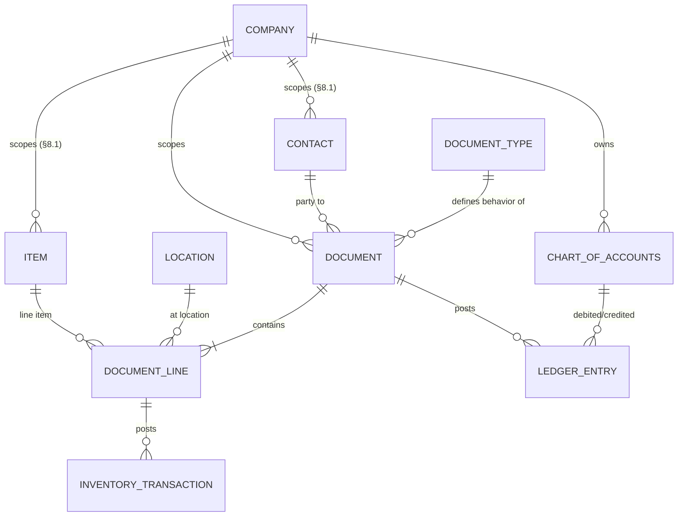
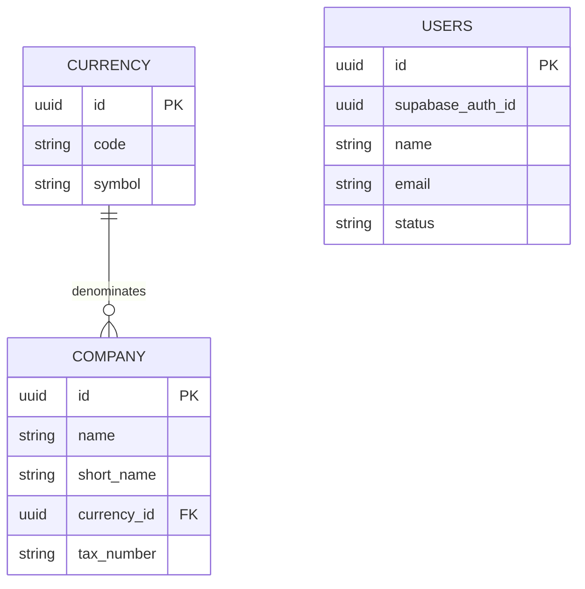
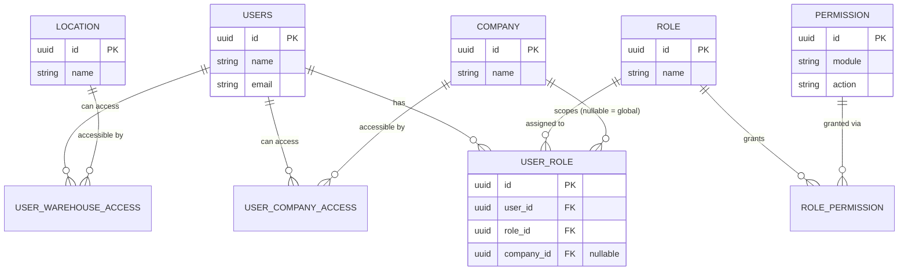
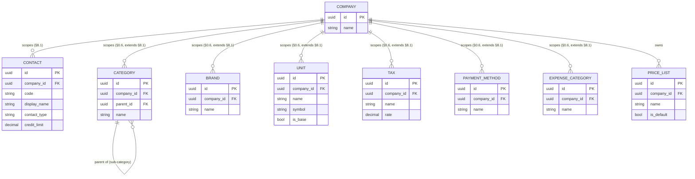
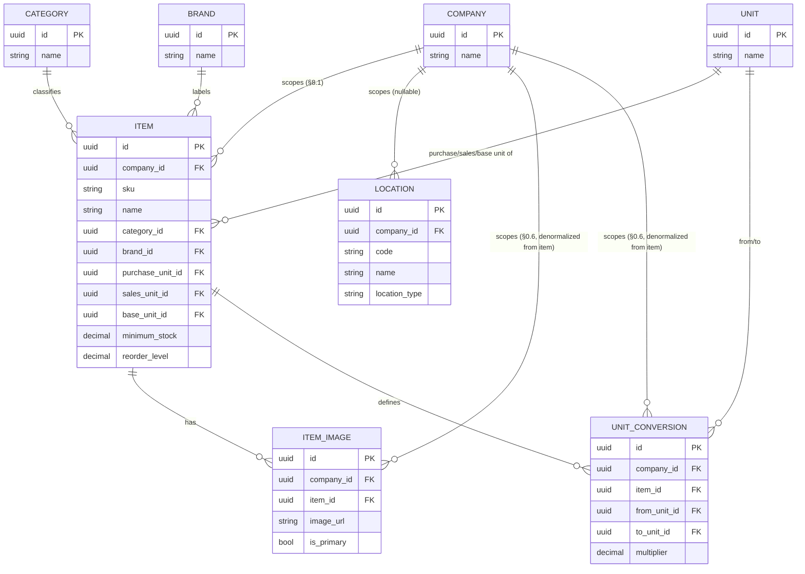
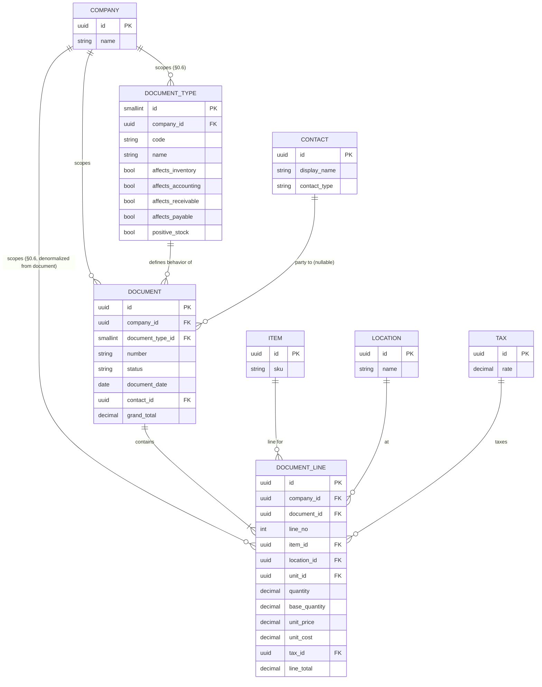
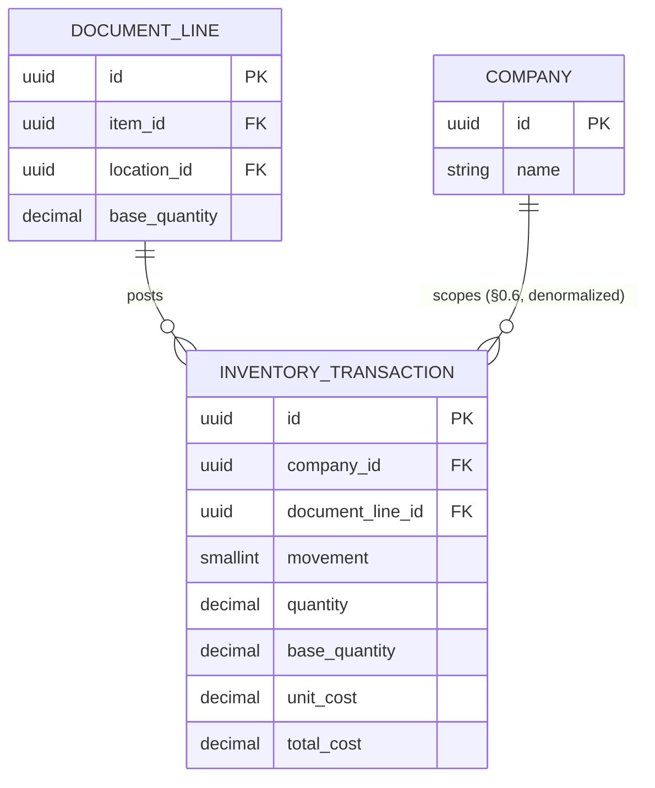
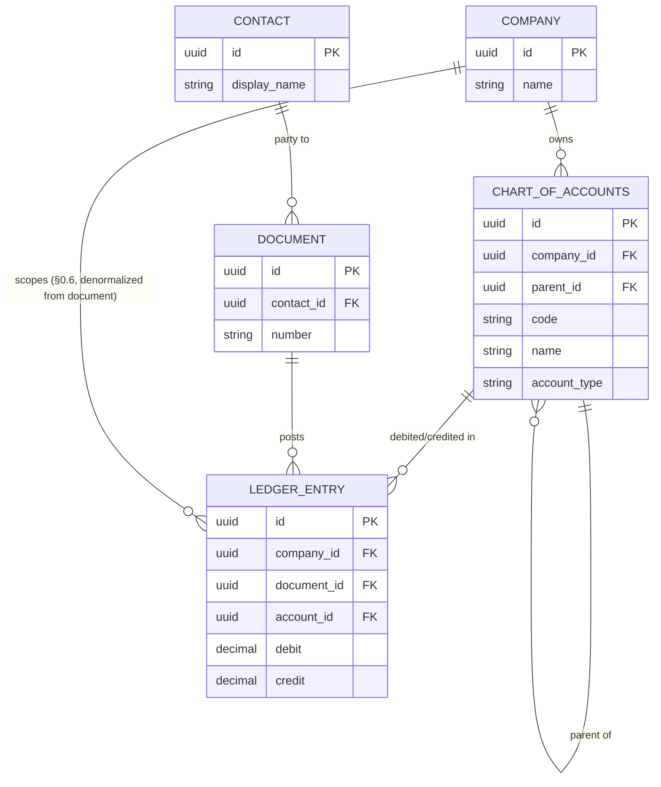
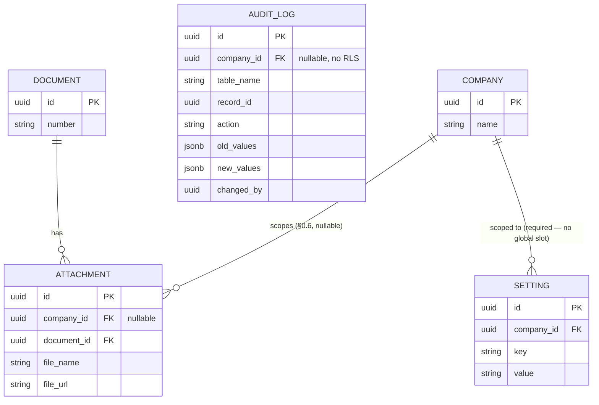

# Royal Hardware ERP — Entity-Relationship Diagram

**Phase:** 4 of 12
**Status:** Draft for approval — **regenerated from the actual schema in [`docs/db/Royal_Hardware_ERP_SQL.md`](db/Royal_Hardware_ERP_SQL.md)**, matching the rewritten [Phase 3](phase-3-database-design.md)
**Depends on:** [Phase 3 — Database Design](phase-3-database-design.md)

Diagrams use Mermaid `erDiagram` syntax. Notation: `||` = exactly one, `o{` = zero-or-many, `|{` = one-or-many, `o|` = zero-or-one.

---

## 0. High-Level Overview

Everything hangs off two universal tables: a **Document** (what kind is decided by **Document Type** — Purchase, Sale, Quotation, Transfer, Adjustment, Return...) made of **Document Lines**, each line optionally naming an **Item** and a **Location**. Posting a document is what creates the two side effects that used to be separate subsystems in the original design: an **Inventory Transaction** per line (if the document type affects inventory) and a **Ledger Entry** per accounting impact (if the document type affects accounting). **Contact** replaces Customer/Supplier as one entity type.

---

## 1. Identity & Companies

`USERS` no longer has a free-text `role`/plaintext `password` (Phase 3 §8.6, resolved) — credentials live in Supabase Auth's own `auth.users`, linked via `supabase_auth_id`. It does have real edges now, just not to `COMPANY` directly — see §1a below for the roles/permissions/access-join tables that connect it.

## 1a. Roles, Permissions & Access (Phase 8)

`ROLE_PERMISSION`, `USER_COMPANY_ACCESS`, `USER_WAREHOUSE_ACCESS` are pure join tables (composite PK, no surrogate id). `USER_ROLE` has a surrogate `id` because `company_id` is nullable and can't be part of a composite primary key — `UNIQUE(user_id, role_id, company_id)` does the uniqueness work instead. Its nullable `company_id` is what lets a user hold a *different* role per company (Admin globally, Salesman just in M52, say): `NULL` = applies in every company the user can access; a set value scopes that one role assignment to just that company. `permissions` is a fixed `module.action` catalog, not user-editable; only the role↔permission link is (Settings → Roles screen, Phase 6/7). `USER_COMPANY_ACCESS` and `USER_WAREHOUSE_ACCESS` are also what the RLS policies read from (`docs/phase-8-authentication.md` §4) — the same two join tables back both the application-level `requirePermission()` scope check and the database-level policy, so they can't drift apart.

## 2. Contacts & Shared Lookups

`PRICE_LIST` has no outgoing edges to `ITEM` or `DOCUMENT_LINE` — nothing references it (Phase 3 §8.7: currently a dead table). `CATEGORY`, `BRAND`, `UNIT`, `TAX`, `PAYMENT_METHOD`, `EXPENSE_CATEGORY` were shared/global lookups until Phase 3 §0.6 — each is now its own row per company (e.g. Royal Hardware and M52 each have their own "Electronics" `CATEGORY` row, not one shared row), with old global-uniqueness constraints (`brands.name`, etc.) becoming `UNIQUE(company_id, ...)`.

## 3. Items & Locations

`ITEM` has no per-location threshold table (`minimum_stock`/`reorder_level` are single global columns) — see Phase 3 §8.4. `ITEM_IMAGE.company_id`/`UNIT_CONVERSION.company_id` (Phase 3 §0.6) duplicate what's already derivable via `item_id → items.company_id` — denormalized so their own RLS policy doesn't need a join.

## 4. Documents — the Universal Transaction Model

`DOCUMENT_TYPE.company_id` (Phase 3 §0.6) means "SALE"/"PURCHASE" etc. are now per-company definitions too — Royal Hardware and M52 each need their own seed rows.

A Local Purchase, Import Purchase, Sale, Quotation, Stock Transfer, Stock Adjustment, Purchase Return, Sales Return, and Invoice are **all `DOCUMENT` rows** — the diagram has no separate `PURCHASE`/`SALE`/`QUOTATION`/`INVOICE` boxes because none exist as tables. `document_type_id` is the only thing distinguishing them.

**Missing relationship, called out explicitly:** there is no edge from a Quotation-type `DOCUMENT` to the Sale-type `DOCUMENT` it converts into — no self-referencing FK, no join table. Phase 3 §8.2 flags this as needing resolution before Phase 9; until then, Quotation→Invoice conversion (FR-QUO-002) cannot be traced in the data.

## 5. Inventory Ledger

No `STOCK_BALANCE` cache table exists (Phase 3 §0.3/§8.3) — stock-on-hand is a live `SUM()` over `INVENTORY_TRANSACTION`, filtered through the item/location on its parent `DOCUMENT_LINE`. A Stock Transfer's "two linked movements" (out of source, into destination) has no explicit two-location structure at the `DOCUMENT` level — see Phase 3 §8.7.

## 6. Accounting

A Customer or Supplier ledger/statement (FR-CUST-002, FR-SUP-002) is derived — `LEDGER_ENTRY JOIN DOCUMENT ON DOCUMENT.id = LEDGER_ENTRY.document_id WHERE DOCUMENT.contact_id = :contact` — rather than stored in a dedicated ledger table per contact.

## 7. Attachments, Audit & Settings

`AUDIT_LOG` is drawn with no FK edges to other business entities — `record_id` is a bare UUID with no polymorphic type column beyond `table_name`, so it cannot be joined generically in the diagram the way `DOCUMENT`-based tables can. Its `company_id` (Phase 3 §0.6) is for filtering only — deliberately no RLS policy, no edge drawn to `COMPANY` here either, since access is gated by `requirePermission('audit','view')` at the app layer instead (Phase 3 §8.6). No `WHATSAPP_TEMPLATE`/`WHATSAPP_MESSAGE_LOG`/`BACKUP` tables exist in this schema (Phase 3 §8.7).

---

## Reading Notes

- Every box that appeared as a bespoke table in the original Phase 3/4 draft (`PURCHASE`, `SALE`, `QUOTATION`, `INVOICE`, `STOCK_TRANSFER`, `STOCK_ADJUSTMENT`, `SALES_RETURN`, `PURCHASE_RETURN`) is gone from these diagrams — they are all rows in `DOCUMENT`/`DOCUMENT_LINE` now, distinguished by `DOCUMENT_TYPE`. Anyone comparing against the old diagrams should expect this collapse, not treat it as tables having been dropped by mistake.
- Diagrams show structural cardinality only; `INVENTORY_TRANSACTION` and `LEDGER_ENTRY` are append-only by convention (no UPDATE/DELETE in application code), same note as the original draft — the ER notation doesn't express immutability.
- Every gap noted inline here traces back to a numbered item in [Phase 3 §8](phase-3-database-design.md#8-divergences-from-phase-1-brd--phase-2-frs) — resolve there, not per-diagram.
- §1a (Roles/Permissions/Access) and the RLS policies it backs were implemented ahead of Phase 9/schedule, to unblock login — see [Phase 3 §1a](phase-3-database-design.md#1a-roles-permissions--access-phase-8--rbac) and `docs/phase-8-authentication.md`.
- Most former "global lookup" boxes (`CATEGORY`, `BRAND`, `UNIT`, `TAX`, `PAYMENT_METHOD`, `EXPENSE_CATEGORY`, `DOCUMENT_TYPE`, `CURRENCY`) and several child/transaction boxes (`DOCUMENT_LINE`, `INVENTORY_TRANSACTION`, `LEDGER_ENTRY`, `ITEM_IMAGE`, `UNIT_CONVERSION`, `ATTACHMENT`) gained a `company_id` edge to `COMPANY` — see [Phase 3 §0.6](phase-3-database-design.md#06-company-scoping-was-extended-to-almost-every-table-implemented-ahead-of-phase-9) for the full list and why `users`/`roles`/`audit_log` were deliberately excluded.

---

**Next Step:** On approval, proceed to **Phase 5 — Folder Structure**. Note that the module-per-domain folder layout in the current Phase 5 draft (`modules/inventory/products`, `modules/sales/quotations`, etc.) was written against the original bespoke-table design — it should be re-checked against this universal `documents`/`document_lines` model before Phase 5 is treated as final, since a "Products module" and a "Quotations module" now share the same underlying repository/service layer (`documents`) rather than each owning a distinct table.
